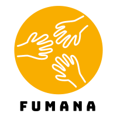
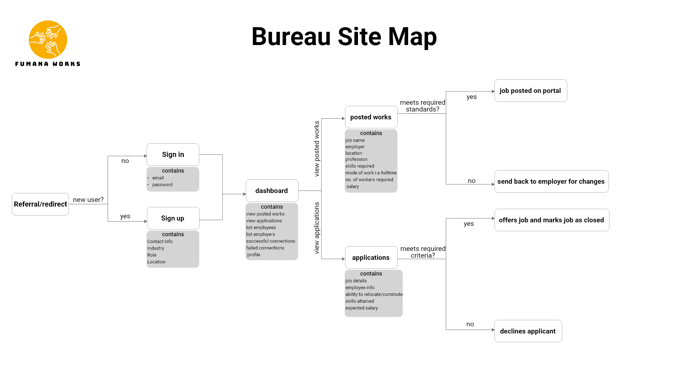
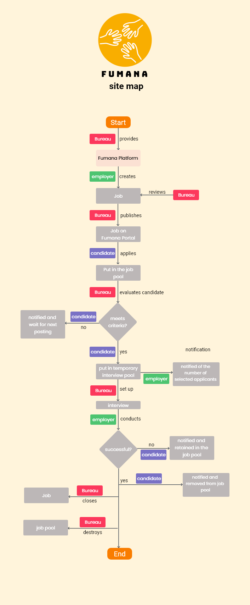
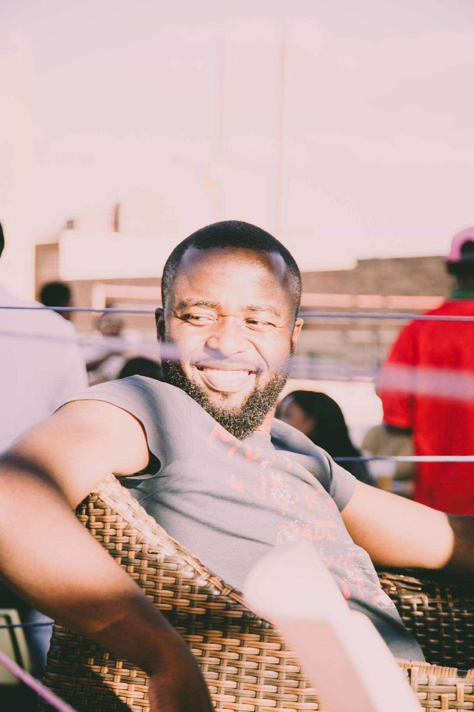
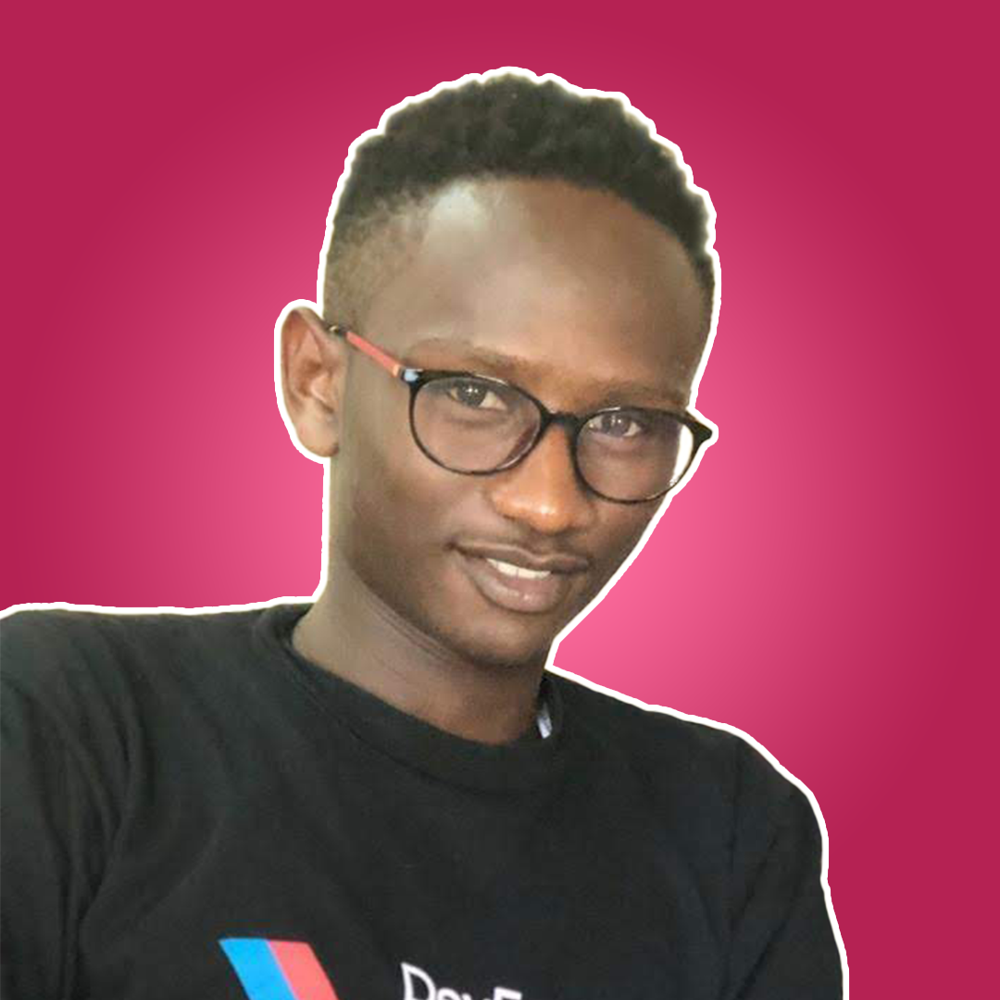
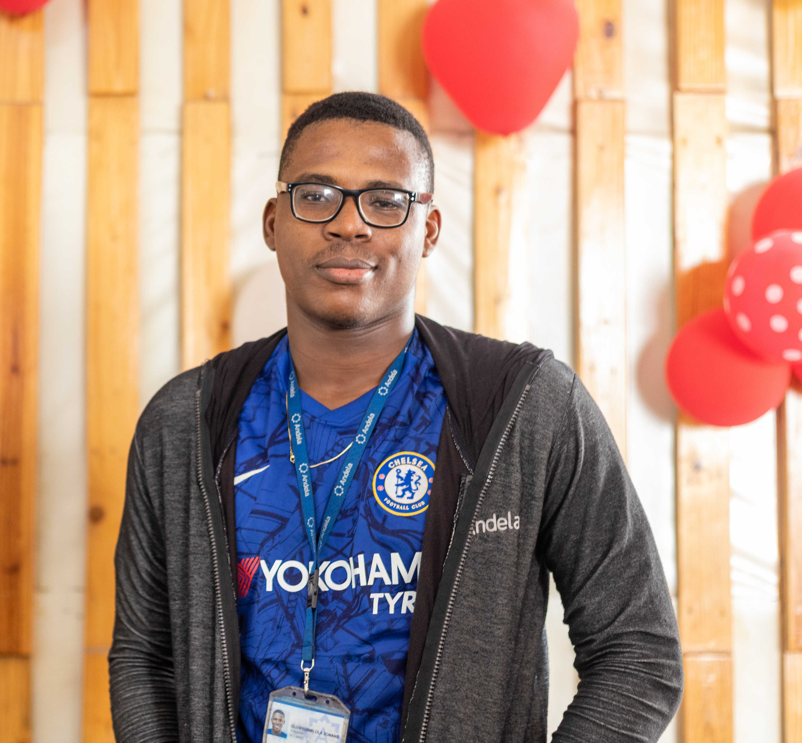

## Team-258-group-a-frontend

# Fumana Work

Our project is called "Fumana" and aims to increase access to jobs for the poorest of the poor.
"Fumana" is a sesotho work meaning "find".

## Table of contents

* 	[General info](#general-info)
* 	[Why](#Why)
* 	[PROBLEM STATEMENT SUMMARY](#PROBLEM-STATEMENT-SUMMARY)
* 	[Goal Summary](#Goal-Summary)
* 	[Problem Statement ](#Problem-Statement )
* 	[Project Overview](#Project-Overview)
* 	[1.1 Idea Description](#1.1-Idea-Description)
* 	[1.2 How will the goal be implemented](#1.2-How-will-the-goal-be-implemented)
* 	[1.3 Who are the market participants](#1.3-Who-are-the-market-participants)
* 	[1.4 Solution structure](#1.4-Solution-structure)
* 	[1.5 Does this project idea solve the stated problem statement](#1.5-Does-this-project-idea-solve-the-stated-problem-statement)
* 	[Screenshots](#screenshots)
* 	[Technologies](#technologies)
* 	[Setup](#setup)
* 	[Features](#features)
* 	[Status](#status)
* 	[Inspiration](#inspiration)
* 	[Contributing](#Contributing)
* 	[Authors](#Authors)
* 	[Other team members](#Other-team-members)

## General info

This project originated as part of the BuildforSDG2020 Challenge with Andela and 
Facebook, which aims to give development experience to software developers in Africa.
Teams could select a problem statement to build a solution for from a list of approved 
problem statements listed under the Sustainable Development Goals.

### Why

Our team selected the SDG category and chose the No poverty sub-category for our 
project because we believe this is the little we can do to help people get a better life. 

## PROBLEM STATEMENT SUMMARY

### Goal Summary

Our first goal aims to end all forms of poverty, including extreme poverty (those living 
under $1.25 per day) and relative poverty (defined at a national level). Eradicating 
poverty is not a task of charity, it is an act of justice and the key to unlocking an 
enormous human potential. Still, nearly half of the world’s population lives in poverty, 
and lack of food and clean water is killing thousands every single day of the year.

### Problem Statement 

Build a tech solution that can be implemented to help reduce poverty in our 
communities. (First of think about the major causes of poverty in your community).

### Project Overview

If we can help implement policies to ensure resources are organized and create 
programs that will end poverty in all its dimensions, we can help in bringing 
Poverty across developing and under-developing countries to a halt.

One of the biggest problems in our community is unemployment. Some churches 
and small NGO's have projects where they have one day a week where job seekers 
and potential employers come to a specific premise (hereafter referred to as a 
labour bureau). Job seekers must fill out a registration form and basic CV, 
and their picture is taken. Employers can come to the premises at a specified 
time to interview the job seekers. Employers pay a fee of R250 which gives them 
access to interview job seekers for a period of three months. The initial target 
market is individual household employers looking for domestic help as well as 
cleaning and garden service companies who would employ people with similar skills.

Our project aims to create a system which can be used by labour bureaus to manage 
the job seekers and employers on their system, and to create a platform where job 
seekers and potential employers can find each other at times that the labour bureau 
is not open. It would also allow a greater number of potential employers to have 
access to the network - at the moment the number of jobseekers far exceed the potential 
employers.

#### 1.1 Idea Description

A platform would be created where labour bureaus can load the information of job seekers 
and potential employers. Registered employers will obtain access to the system to be able 
to load and administer available jobs. Job seekers will be able to register and send in 
job applications on online. The labour bureau will also be able to add, delete, update 
the records on the system.

The system will also contain an attendance module which can be used by the labour bureau to 
record which job seekers and employers attend the weekly open days and how many jobs are 
filled.Job seeker skills can be uploaded onto the system, and thus an online CV will be 
created. Labour bureaus can do reference checks on potential employers and job seekers.

### 1.2 How will the goal be implemented

By improving chances of job seekers to find work, unemployment and poverty can be reduced.

### 1.3 Who are the market participants

The initial market will be small labour bureaus servicing private households and potential 
domestic workers.
The main customer base would be the labour bureaus.
Potential employers and job seekers would have to register a user profile under a specific 
labour bureau, and will only be able to do so by invitation - but this process can also be 
automated.
It will not be compulsory for employers and job seekers to register on the portal - the 
labour bureau should be able to also use the system to keep track of their current clients.

### 1.4 Solution structure

Labour bureau will load potential employers and job seekers on the platform, and record 
attendance.
An online CV will be created for job seekers.
Potential employers can advertise and manage jobs on the system.
Available jobs will be advertised so that job seekers can apply for specific jobs.
The employers can review the applicants online, and an SMS, WhatsApp or e-mail can be 
sent from the system to the potential job seekers to attend the interview at the labour 
bureau premises in the arranged time, and thus the safety of both the employers and the 
job seekers will be protected, and the risk of human trafficking can be reduced. Personal 
details will only be shared once the employment relationship commences.
Employers must close filled jobs by indicating which job seeker were the successful applicant. 
This process can also be managed manually by the labour bureau if the job seekers and potential 
employers are not system users.

### 1.5 Does this project idea solve the stated problem statement

Yes, the system will help bring potential employers and job seekers together and thus reduce 
unemployment.

## Screenshots

## Technologies

* 	going to be added by the end of the project
* 	Tech 1 - version 1.0
* 	Tech 2 - version 2.0
* 	Tech 3 - version 3.0

## Setup

Describe how to install / setup your local environement / add link to demo version.

## Code Examples

Show examples of usage:
`put-your-code-here`

## Features

List of features ready and TODOs for future development
* 	Giving employers the capability to also keep track of employee attendance
* 	Payroll and UIF registration and submissions
* 	Also to send mobile money to job seekers so that they can afford to attend the interview.
* 	Include an approximate distance calculator as well as a travel cost estimator, so that employers can be aware of the distances that the job seekers have to travel,
* 	And take this in consideration when calculating remuneration package.
* 	Information could also be used so that job seekers who live close together can pool resources to arrange transport to the weekly sessions, and thus save costs.

To-do list:
* 	Wow improvement to be done 1
* 	Wow improvement to be done 2

## Status

Project is: _in progress_

## Inspiration

Thank you to Andela and Facebook for giving us the opportunity to work on this project.
, our team mentor - thank you for all your patience and advice!
Did you use someone else’s code?
Do you want to thank someone explicitly? Did someone’s blog post spark off a wonderful 
idea or give you a solution to nagging problem? The labour bureau at Lynnwoodrif Dutch 
Reformed Church in Pretoria Gauteng sparked the idea for the project.
One of our team members also apply for tutoring jobs through a tutoring agency that uses 
TutorCruncher, so this may have impacted the idea for a potential solution.

## Contributing

If this project sounds interesting to you and you'd like to contribute, thank you! First, 
you can send a mail to [@buildforsdg@andela.com](https://www.buildforsdg@andela.com) to indicate your interest, why you'd like 
to support and what forms of support you can bring to the table, but here are areas we 
think we'd need the most help in this project :

1. Area one - this app is deals with human trafficking and you need feedback on your roadmap and feature list from the private sector / NGOs
2. Area two - you want people to opt-in and try using your staging app at staging.project-name.com and report any bugs via a form
3. Area three - here is the zoom link to our end-of sprint webinar, join and provide feedback as a stakeholder if you can
	
## Authors

BuildforSDG Challenge 2020 - Team 258 - Fumana Project- Team Members

|Picture|Team Role|Name|Country|City|Github|
|---|---|---|---|---|---|
|       |Team Assistant |Emilia                 |Country     |City         |Github    |
|       |Team Mentor    |Name                   |Country     |City         |Github    |
|               |Team Leader    |Dibwe Kalangu          |South Africa|Johannesburg |leanny01  |
|       |Project Manager|Sphesihle Zulu         |South Africa|KwaZulu Natal|sphezulu  |
||Front-End Dev  |Emmanuel Uchenna       |Nigeria     |Ebony State  |eunit99   |
|         |UI/UX Dev      |Kelvin Mutiso          |Kenya       |Nairobi      |mutisikelv|
|       |Back-End Dev   |Soninake Oluwadamilola |Nigeria     |Lagos        |damiso15  |

### Other team members

We also wish to thank our team members who could for various reasons not participate in the final project:
Lebogang, Xolisani Mthethwa, Mohamed Adam Mohamed, Melvin Masote. It was great meeting all of you and we appreciate the time 
you committed to the project!
Maybe we can still build the fumana project together one day!
